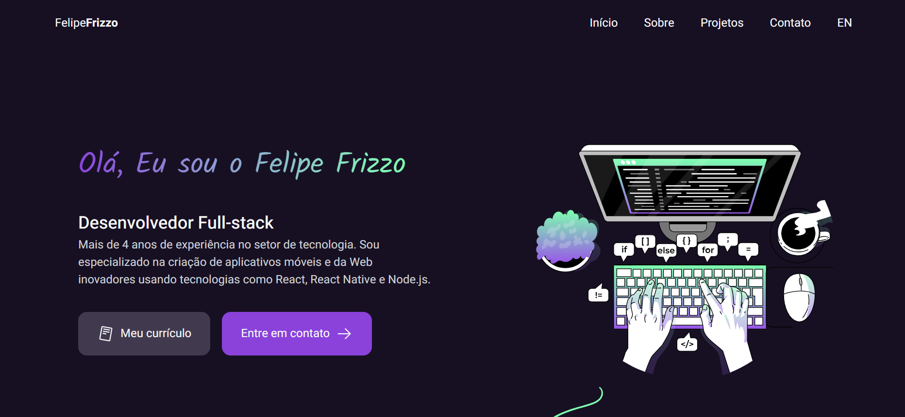
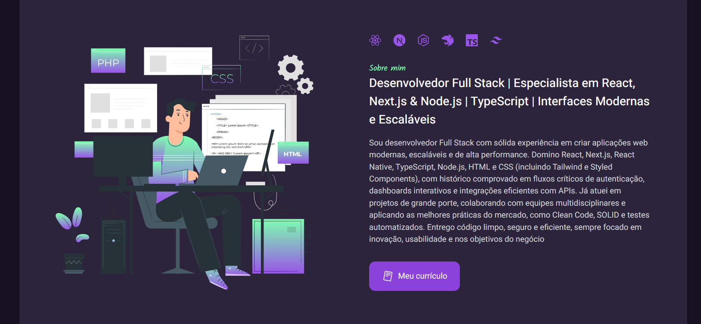
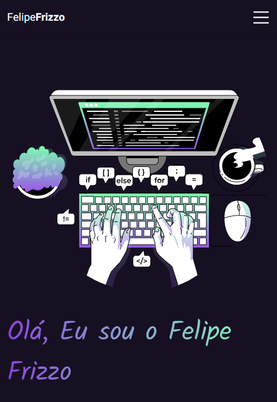
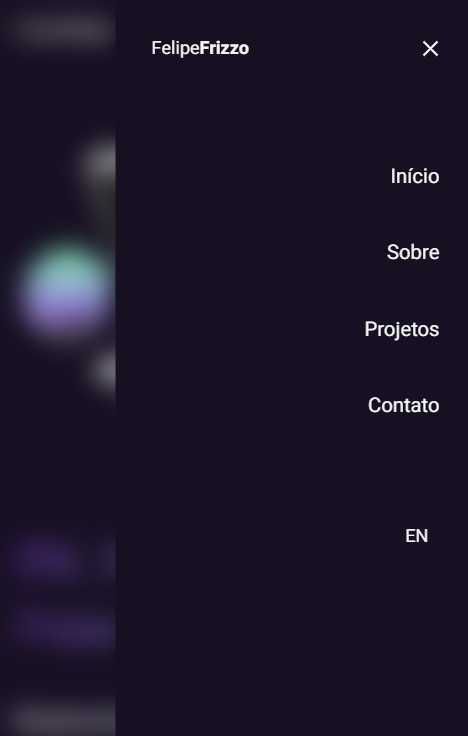

# ✨ Portfólio — Felipe Frizzo

Bem-vindo ao repositório do meu portfólio pessoal!  
Este projeto foi desenvolvido para apresentar meus principais trabalhos de forma responsiva, otimizada e multilíngue.

🌐  [Veja em produção](https://portfolio-two-nu-9i6h4ucrac.vercel.app/)

## 🛠️ Tecnologias e Ferramentas

-   **Next.js 14+ (App Router)**  — Rotas dinâmicas por idioma (`[locale]`) e projeto (`[slug]`)
    
-   **TypeScript**  — Segurança e robustez em todo o código
    
-   **Tailwind CSS**  — Layout mobile first, utilitários e responsividade
    
-   **next-intl**  — Internacionalização completa (pt/en)
    
-   **Vercel**  — Deploy contínuo e gerenciamento de variáveis seguras
    
-   **API de e-mail**  — Envio real de mensagens pelo formulário de contato
    
-   **Outros:**  React Icons, animações, UI acessível
    

## ⚙️ Funcionalidades

-   📱  **Totalmente Responsivo**  — Mobile first, visual limpo em qualquer dispositivo
    
-   🌐  **Multilíngue**  — Suporte a pt/en com troca integrada por rota e botão
    
-   🧩  **Cards dinâmicos de projetos**, cada um com página própria
    
-   📨  **Formulário de contato funcional**  — envio real de e-mail e feedback visível
    
-   💡  **Menu hambúrguer animado**  — Slide-in, blur de fundo, acessibilidade
    
-   🏷️  **Controle de projetos destacados**  para exibir os principais na página inicial
    
-   ⚡  **SEO básico**  — Títulos e descrições dinâmicos
    

## 🚀 Executando localmente

bash

`# 1. Clone este repositório git clone https://github.com/felipefrizzovg/portfolio cd portfolio   # 2. Instale as dependências npm  install   # 3. Crie o arquivo .env.local touch .env.local` 

**Exemplo de .env.local:**

text

`GMAIL_USERNAME=seuemail@gmail.com GMAIL_PASSWORD=suasenhaouappkey` 

bash

`# 4. Inicie npm run dev` 

Acesse em  [http://localhost:3000](http://localhost:3000/)

## ⚠️ Deploy na Vercel

Adicione as variáveis  `.env.local`  manualmente no painel da Vercel:

-   `GMAIL_USERNAME`
    
-   `GMAIL_PASSWORD`
    

## 🧭 Organização das rotas

-   `/[locale]`: Internacionalização (`pt`/`en`) via next-intl
    
-   `/projects/[slug]`: Página dinâmica para cada projeto
    
-   Dados dinâmicos via traduções, chaves como  `projects.{slug}.{campo}`
    

## 📸 Screenshots

### Desktop

### Mobile

## 📬 Contato

-   ✉️ Email:  [felipefrizzovg@gmail.com](mailto:felipefrizzovg@gmail.com)
    
-   💼  [LinkedIn](https://www.linkedin.com/in/felipe-frizzo)
    
-   💻  [GitHub](https://github.com/felipefrizzovg)
    

## 👨‍💻 Como contribuir

Pull requests e sugestões são bem-vindas.  
Abra uma issue ou PR explicando sua proposta.

## ✨ Créditos e Inspiração

-   Layout e UX inspirados na Rocketseat
    
-   Foco em práticas modernas: acessibilidade, performance, código limpo
    

Desenvolvido com 💜 por  **Felipe Frizzo**

# ✨ Portfolio — Felipe Frizzo

Welcome to my personal portfolio repository!  
This project was built to showcase my best works with a focus on performance, responsiveness, and internationalization.

🌐  [See Live on Vercel](https://portfolio-two-nu-9i6h4ucrac.vercel.app/)

## 🛠️ Tech Stack

-   **Next.js 14+ (App Router)**  — Dynamic routing by language (`[locale]`) and project (`[slug]`)
    
-   **TypeScript**  — Full type safety
    
-   **Tailwind CSS**  — Mobile-first utility styling
    
-   **next-intl**  — Full i18n (pt/en) with seamless language switch
    
-   **Vercel**  — Serverless deployment and environment variable management
    
-   **Email API**  — Functional email sending from the contact form
    
-   **Other:**  React Icons, animation utilities, accessible UI
    

## ⚙️ Features

-   📱  **Fully mobile-first, responsive layout**
    
-   🌐  **Multilanguage**  — pt/en with route-based switch and toggle button
    
-   🧩  **Dynamic project cards**, each with its own page
    
-   📨  **Working contact form**  — real email sending with instant feedback
    
-   💡  **Animated hamburger sidebar**  — slide-in, blur overlay, accessible controls
    
-   🏷️  **Highlighted projects control**  — only main projects on home
    
-   ⚡  **Basic SEO**  — Dynamic titles and descriptions
    

## 🚀 Running locally

bash

`# 1. Clone this repo git clone https://github.com/felipefrizzovg/portfolio cd portfolio   # 2. Install dependencies npm  install   # 3. Create the env file touch .env.local` 

**Example  `.env.local`:**

text

`GMAIL_USERNAME=youremail@gmail.com GMAIL_PASSWORD=yourpasswordORappkey` 

bash

`# 4. Start the dev server npm run dev` 

Go to  [http://localhost:3000](http://localhost:3000/)

## ⚠️ Deploying to Vercel

Add environment variables in your project settings on Vercel:

-   `GMAIL_USERNAME`
    
-   `GMAIL_PASSWORD`
    

## 🧭 Routes organization

-   `/[locale]`: Internationalization (`pt`/`en`) via next-intl
    
-   `/projects/[slug]`: Dynamic page for each project
    
-   Dynamic data via translations, such as  `projects.{slug}.{field}`
    

## 📸 Screenshots

### Desktop

### Desktop

### Mobile

## 📬 Contact

-   ✉️ Email:  [felipefrizzovg@gmail.com](mailto:felipefrizzovg@gmail.com)
    
-   💼  [LinkedIn](https://www.linkedin.com/in/felipe-frizzo)
    
-   💻  [GitHub](https://github.com/felipefrizzovg)
    

## 👨‍💻 Contributing

Pull requests, issues, and suggestions are welcome.  
Please open an issue or PR with your proposal.

## ✨ Inspiration & Credits

-   Inspired by Rocketseat's layouts and best practices
    
-   Built with accessibility, performance and clean code in mind
    

Made with 💜 by  **Felipe Frizzo**